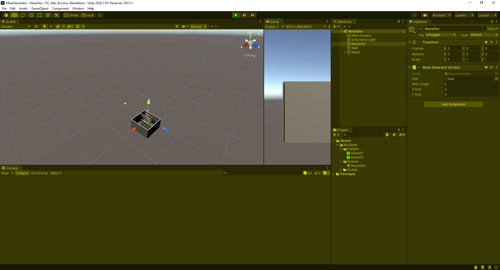
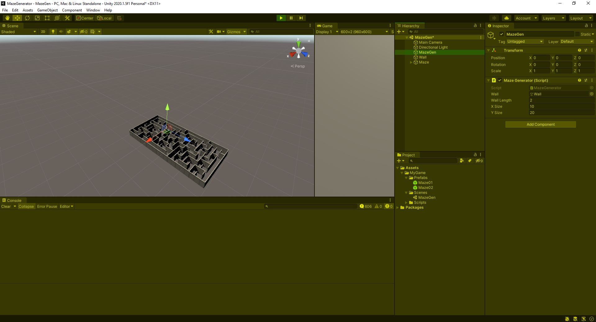

# MazeGenerator

###Description
The MazeGenerator is based on the Tutorial (http://flattutorials.blogspot.de/2015/02/lets-create-perfect-maze-generator.html, the link is broken 05.10.20). 
With the script, you can generate a perfect maze. 
You can make a prefab and use this as the basis for your maze.
You can modify the maze materials, custom models.
This project contains a scene "MazeGen". The GameObject MazeGen hook up the script MazeGenerator. This component takes a GameObject
Wall (use the provided or another one) with Wall Length 2 (z-axis unit of the wall), x, and y size. 

Run the project the maze will be generated (Maze GameObject). Drag and Drop the Maze in Playmode into the Prefabs folder to save
it for further usage.

###Development platform
Unity 2020.1.5f1, Windows 10, Visual Studio Community 2019

   